# Hisn Al-Muslim

<p align="center">
  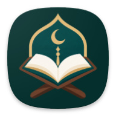
</p>

<p align="center">
  <strong>A modern Islamic companion application built with Flutter.</strong>
</p>

<p align="center">
  Quran • Prayer • Adhkar • Islamic Learning • Audio • Reminders
</p>

---

## 📱 App Preview

<p align="center">
  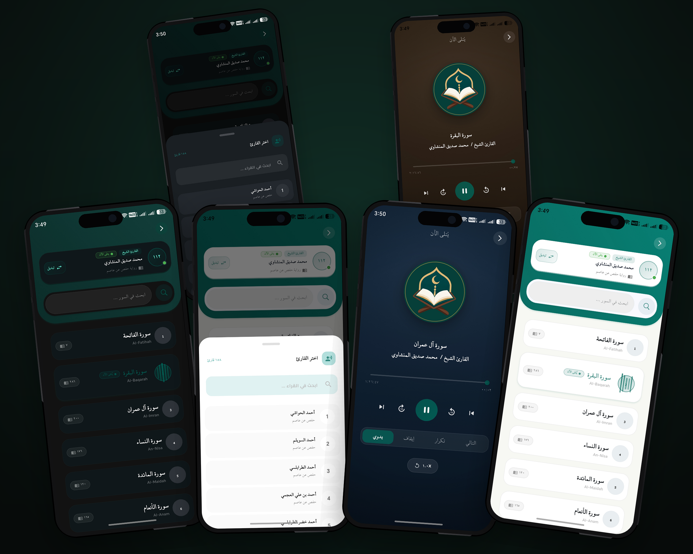
  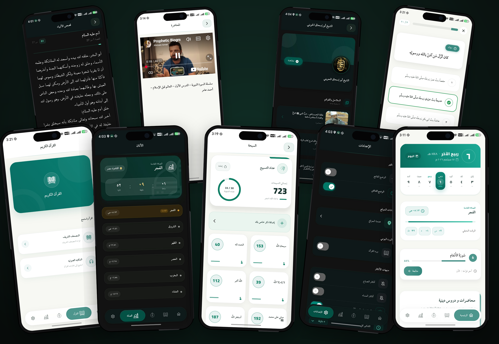
</p>

<p align="center">
  <em>A visual overview of the Hisn Al-Muslim experience.</em>
</p>

---

## 📱 About the Project

**Hisn Al-Muslim** is a modern Islamic mobile application designed to bring everyday Islamic tools, Quran content, remembrance, prayer information, audio experiences, and educational material together in one calm and accessible experience.

The application combines Quran reading and audio, prayer-time information, Adhkar, Hadith, Islamic educational content, Qibla guidance, Tasbeeh, reminders, Stories of the Prophets, and additional Islamic resources.

> **This is the public showcase repository.**  
> The production source code is maintained separately in a private repository and is intentionally **not included here**. This repository is dedicated to project presentation, documentation, UI/UX previews, and selected public assets.

---

## ✨ Highlights

- 📖 Quran browsing and reading
- 🎧 Quran audio with reciter selection and playback controls
- 🕌 Prayer times and next-prayer information
- 📿 Adhkar and daily remembrance
- 📜 Hadith collections and reading
- 🤲 Duas and Islamic supplications
- 🕋 Names of Allah
- 🧭 Qibla direction experience
- 📚 Islamic lectures, lessons, videos, and playlists
- 📿 Digital Tasbeeh
- 🌙 Hijri calendar and Islamic date information
- 🔔 Configurable reminders
- 🌗 Light and dark themes
- 📚 Stories of the Prophets and Islamic educational content
- ❓ Islamic questions and learning resources

---

# 🏠 Home Experience

The home screen brings important daily information and frequently used Islamic content into one focused dashboard.

### ☀️ Light Theme & 🌙 Dark Theme

<p align="center">
  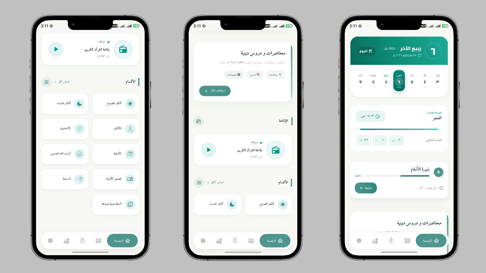
  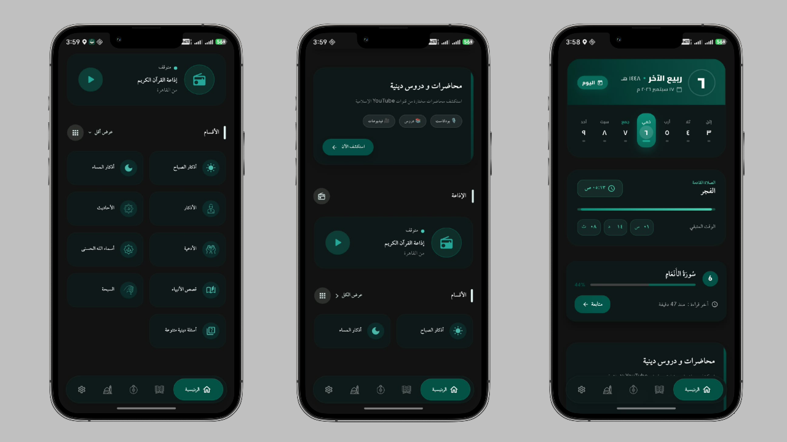
</p>

<p align="center">
  <strong>Light Theme</strong>&nbsp;&nbsp;&nbsp;&nbsp;&nbsp;&nbsp;&nbsp;&nbsp;&nbsp;&nbsp;
  <strong>Dark Theme</strong>
</p>

The home experience can surface:

- Islamic date and daily information
- Current and upcoming prayer information
- Quran reading progress
- Daily Islamic content
- Quick access to major application sections
- A consistent light/dark visual experience

---

# 📖 Quran Experience

The Quran experience is built around reading, browsing, and listening, with dedicated interfaces for different parts of the journey.

## 📚 Quran Reading

### ☀️ Light Theme & 🌙 Dark Theme

<p align="center">
  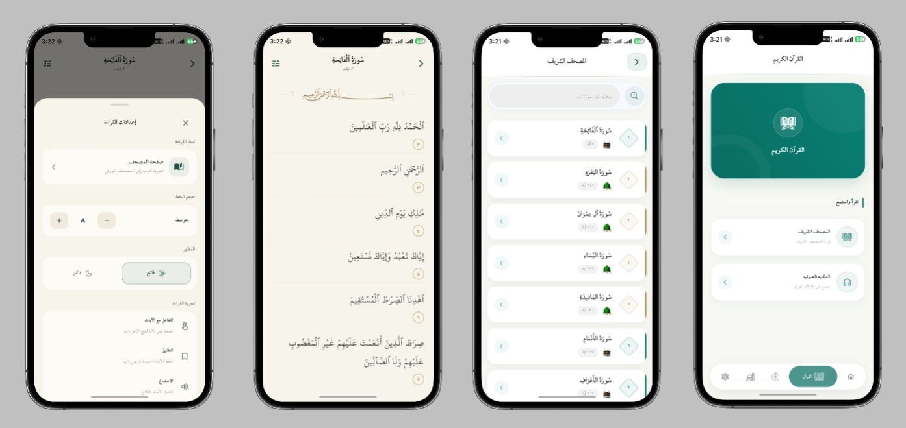
  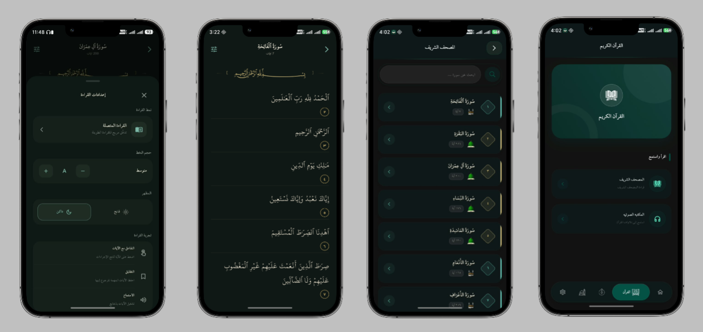
</p>

<p align="center">
  <strong>Light Theme</strong>&nbsp;&nbsp;&nbsp;&nbsp;&nbsp;&nbsp;&nbsp;&nbsp;&nbsp;&nbsp;
  <strong>Dark Theme</strong>
</p>

The reading experience focuses on clear Arabic text presentation, comfortable reading, navigation through verses, and interaction with Quran content.

## 🎧 Quran Audio

### ☀️ Light Theme & 🌙 Dark Theme

<p align="center">
  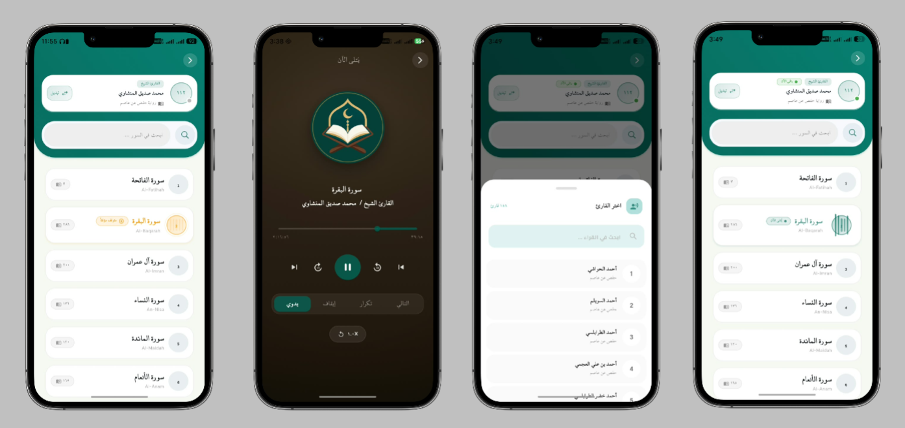
  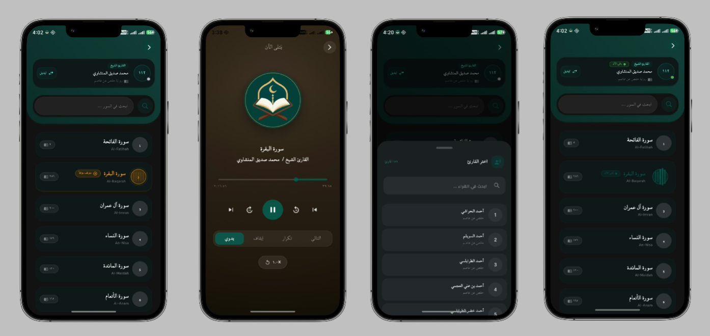
</p>

<p align="center">
  <strong>Light Theme</strong>&nbsp;&nbsp;&nbsp;&nbsp;&nbsp;&nbsp;&nbsp;&nbsp;&nbsp;&nbsp;
  <strong>Dark Theme</strong>
</p>

The audio flow provides reciter selection and a dedicated listening experience.

---

# 🎧 Quran Audio Player

The dedicated Quran player provides the main controls needed for focused listening.

<p align="center">
  
</p>


The player showcases:

- Current Surah and reciter information
- Playback progress
- Play / pause
- Previous / next controls
- Skip controls
- Playback mode options
- Repeat and continuation controls
- A focused listening layout

---

# 🕌 Prayer & Islamic Content

Prayer information is integrated into the daily experience alongside other Islamic content.

<p align="center">
  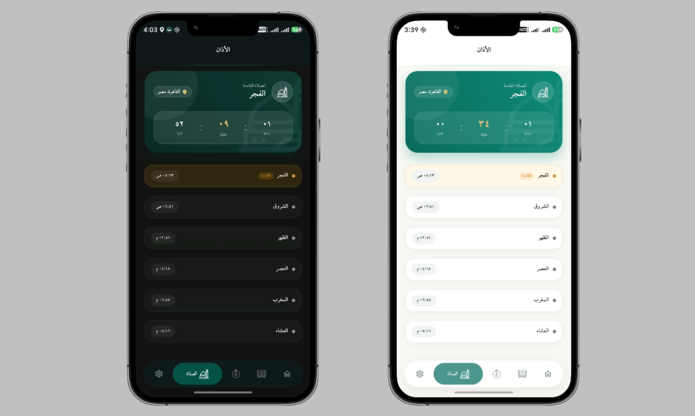
</p>

The prayer experience includes:

- Fajr
- Sunrise
- Dhuhr
- Asr
- Maghrib
- Isha
- Current/upcoming prayer
- Remaining time
- Prayer progress
- Location-aware prayer information

The same showcase also presents related Islamic experiences such as Names of Allah, Jami Dua, and other organized Islamic content.

---

# 📿 Adhkar

Hisn Al-Muslim provides organized experiences for everyday remembrance.

<p align="center">
  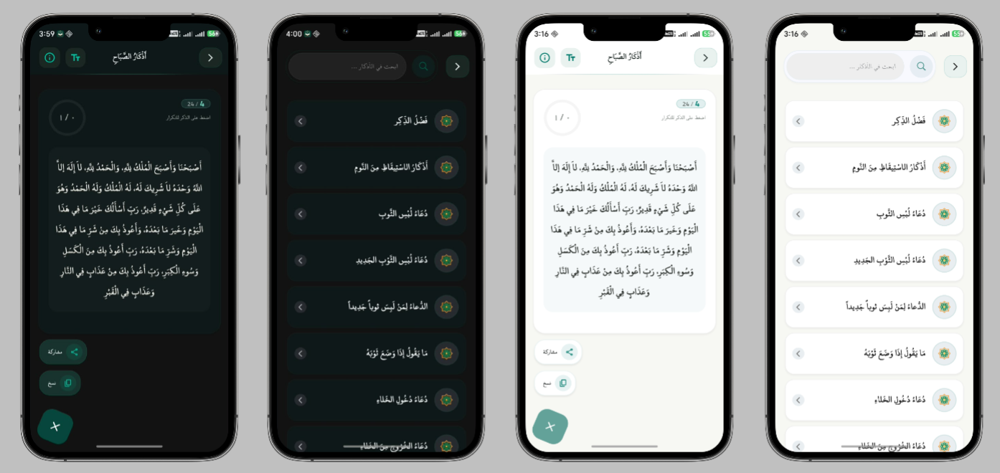
</p>

The Adhkar experience supports:

- Browsing organized remembrance content
- Searching for a specific Dhikr
- Reading individual remembrance items
- Copying and sharing content
- Navigating categorized collections

---

# 📜 Hadith

The application includes a dedicated Hadith experience for browsing and reading Islamic narrations.

<p align="center">
  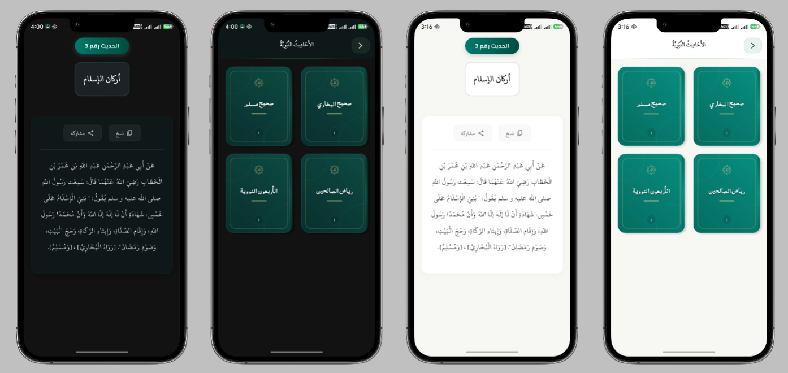
</p>

The showcased experience includes:

- Hadith browsing
- Individual Hadith reading
- Search and discovery
- Sharing and copying actions
- Light and dark reading states

The source project includes collections such as **Sahih Al-Bukhari, Sahih Muslim, Riyad As-Salihin, and Forty Hadith Al-Nawawi**.

---

# 📚 Islamic Lectures & Educational Content

The application provides an educational content experience for Islamic lectures, lessons, videos, channels, and playlists.

### ☀️ Light Theme & 🌙 Dark Theme

<p align="center">
  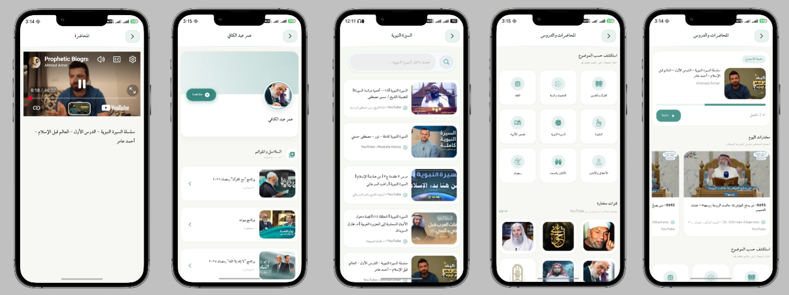
  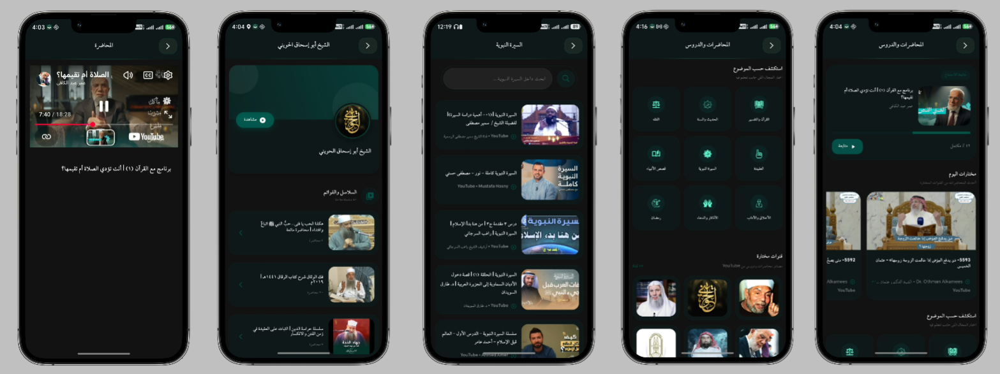
</p>

<p align="center">
  <strong>Light Theme</strong>&nbsp;&nbsp;&nbsp;&nbsp;&nbsp;&nbsp;&nbsp;&nbsp;&nbsp;&nbsp;
  <strong>Dark Theme</strong>
</p>

The screens demonstrate:

- Featured and selected content
- Islamic lectures
- Video cards
- Educational categories
- Islamic channels
- Playlist-oriented discovery
- YouTube-based video playback
- Content progress and continuation

---

# 🕋 Qibla

The Qibla section provides a dedicated visual experience for discovering the direction of the Kaaba.

<p align="center">
  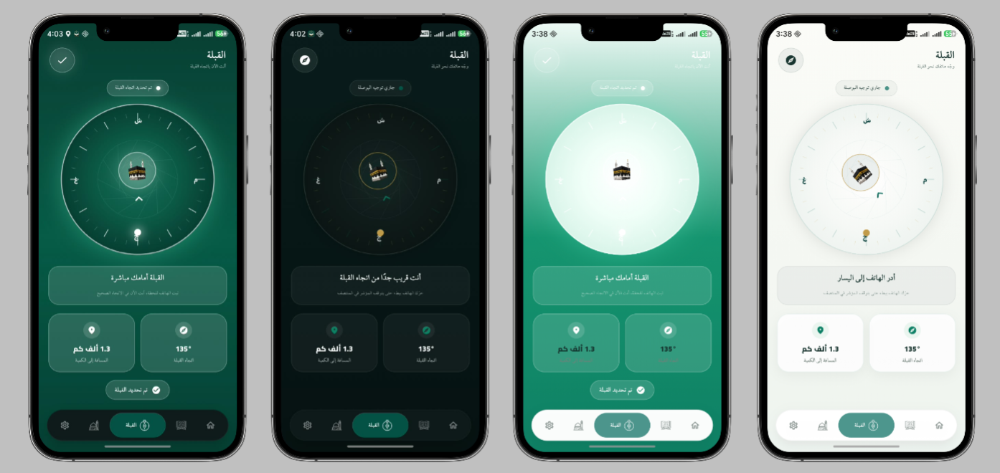
</p>

The showcased experience demonstrates:

- Qibla direction visualization
- Direction and distance information
- Location-aware presentation
- Guided interaction
- Additional Islamic progress states

---

# ⚙️ Settings & Personalization

Settings bring appearance, reminders, and daily preferences together.

<p align="center">
  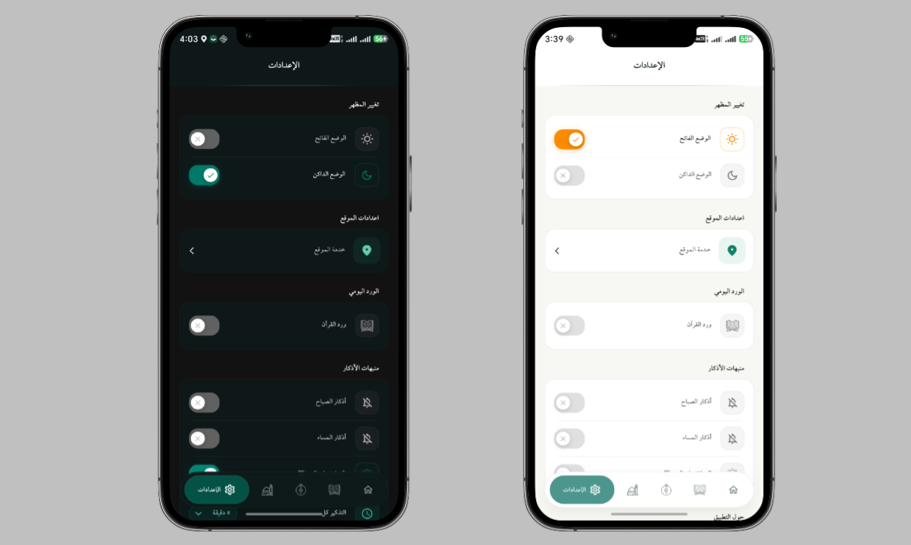
</p>

The interface demonstrates areas such as:

- Light / dark appearance
- Prayer-related preferences
- Reminder settings
- Quran Wird preferences
- Morning and evening Adhkar reminders
- Notification preferences
- Daily preferences

The showcase also includes the **Stories of the Prophets** experience with a browsable list and focused reading screen.

---

# 📖 Stories of the Prophets

<p align="center">
  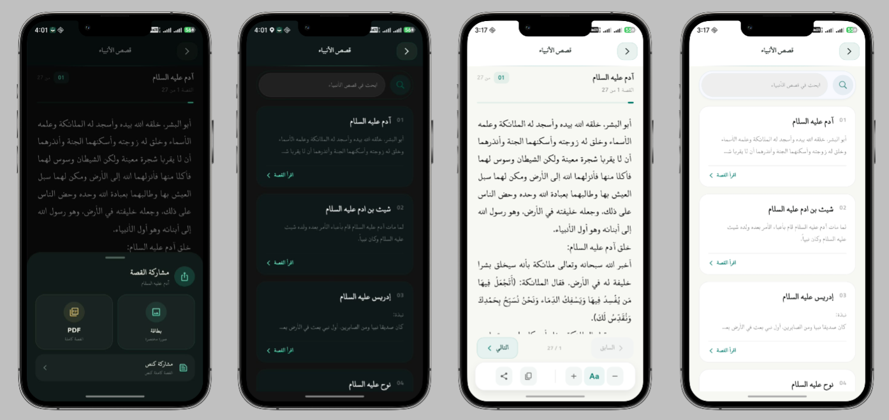
</p>

A dedicated reading experience for exploring Stories of the Prophets through an organized list and focused reading interface.

---

# 📿 Digital Tasbeeh

<p align="center">
  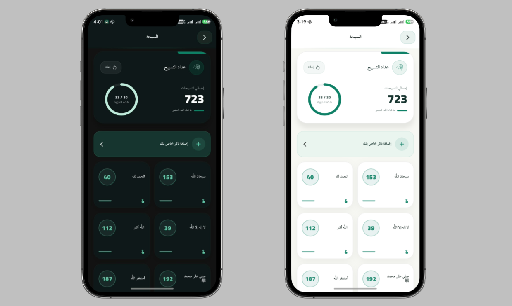
</p>

A focused digital Tasbeeh experience designed for simple and convenient daily remembrance.

---

# 🤲 Jami Dua

<p align="center">
  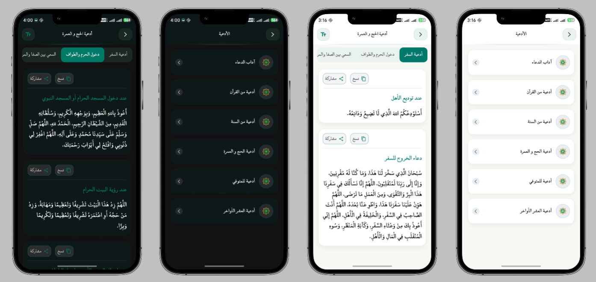
</p>

An organized space for accessing and reading Islamic supplications.

---

# ❓ Islamic Questions & Content

### ☀️ Light Theme & 🌙 Dark Theme

<p align="center">
  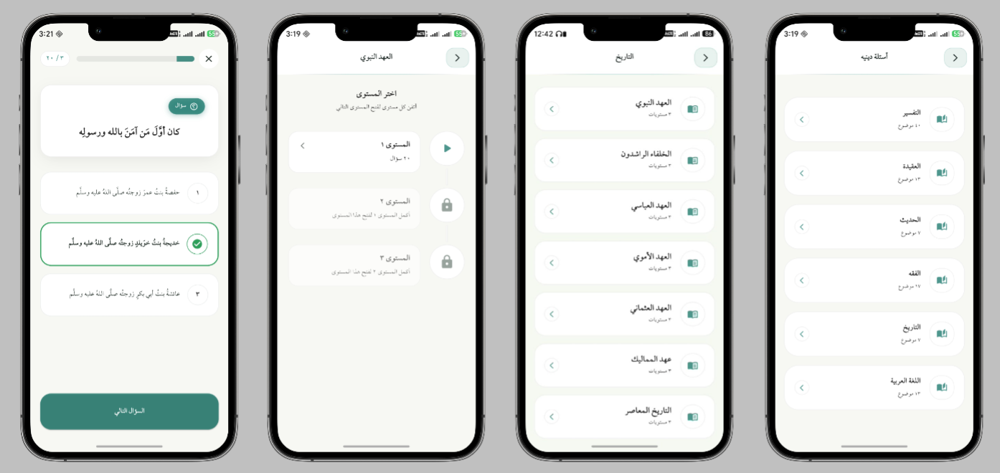
  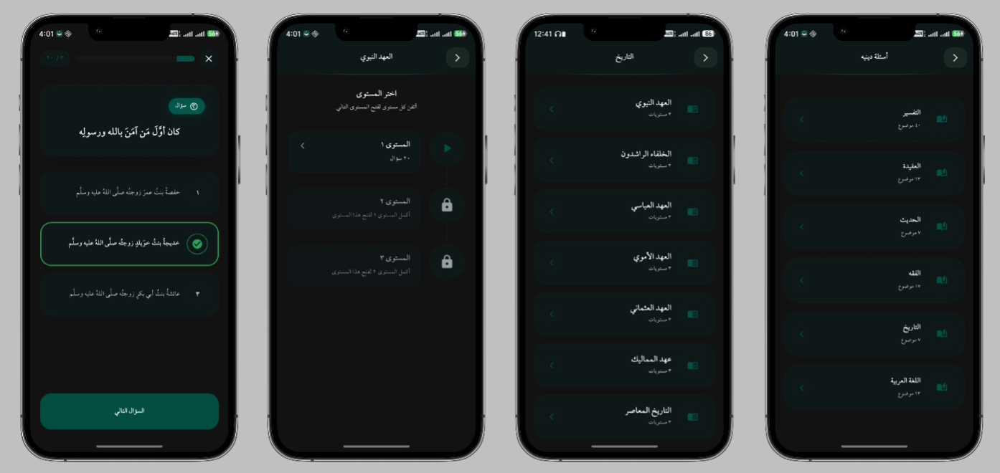
</p>

<p align="center">
  <strong>Light Theme</strong>&nbsp;&nbsp;&nbsp;&nbsp;&nbsp;&nbsp;&nbsp;&nbsp;&nbsp;&nbsp;
  <strong>Dark Theme</strong>
</p>

The application also provides organized Islamic questions and educational content as part of the broader learning experience.

---

# 🔔 Reminders & Daily Experience

The application includes configurable reminders and daily preferences intended to help users keep frequently used Islamic routines accessible.

Related settings and reminder interfaces are presented in the Settings showcase above.

---

# 🎨 Design System

The application follows a calm, modern visual language built around:

- Deep green and teal tones
- Clean Arabic typography
- Rounded cards and surfaces
- Clear information hierarchy
- Comfortable reading layouts
- Light and dark themes
- Consistent navigation patterns
- Responsive, mobile-first interaction

The showcase intentionally presents both themes where separate light/dark screens are available.

---

# 🛠️ Technology

The production application is built with:

| Area | Technology |
|---|---|
| Mobile framework | Flutter |
| Language | Dart |
| State management | BLoC / Cubit |
| Backend services | Firebase + HTTP/API integrations |
| Audio | Flutter audio ecosystem |
| Notifications | Local notifications |
| Location | Geolocation services |
| Educational video | YouTube integration |
| UI | Responsive Flutter UI + reusable components |

> Implementation details, internal architecture, environment configuration, service credentials, and production source code are intentionally kept outside this public repository.

---

# 🏗️ Engineering Approach

The production application is developed with an emphasis on:

- Feature-oriented organization
- Reusable UI components
- Separation of responsibilities
- State-driven UI
- Dependency injection
- Local persistence
- API-based content
- Audio service integration
- Notification scheduling
- Location-aware functionality
- Platform-specific Android/iOS configuration

This repository intentionally documents the **product and user experience**, not the internal implementation.


---
# 🏗️ Project Structure

Hisn Al-Muslim is a Flutter-based mobile application organized around
feature-oriented modules and platform-specific configurations.

The following structure represents the architecture of the original
production project. The production source code itself is maintained
privately and is **not included in this public showcase repository**.

```text
hisn_almuslim/
│
├── android/
│ 
├── ios/
│  
├── web/
│   
│
│
├── lib/
│   │
│   ├── core/
│   │   
│   │
│   ├── features/
│   │   │
│   │   ├── adhan/
│   │   ├── al_azkar/
│   │   ├── asma_allah/
│   │   ├── hadith/
│   │   ├── hisn_al_muslim/
│   │   ├── home/
│   │   ├── islamic_quiz/
│   │   ├── jami_dua/
│   │   ├── lectures/
│   │   ├── qibla/
│   │   ├── quran/
│   │   ├── quran_audio/
│   │   ├── radio/
│   │   ├── settings/
│   │   ├── stories/
│   │   └── tasbeeh/
│   │
│   └── main.dart
│
├── assets/
│   ├── audio/
│   ├── images/
│   ├── json/
│   |__ fonts/
│
├── test/
│   └── Application tests
│
├── functions/
│   └── Backend / Firebase functions
│
├── pubspec.yaml
├── analysis_options.yaml
├── firebase.json
└── README.md

```

---

# 📲 Distribution

Official download links will be added here as each distribution channel becomes available.

### Android

- **Google Play:** Coming soon
- **App Store:** Coming soon
- **Uptodown:** Coming soon


---


<p align="center">
  
</p>

<p align="center">
  <strong>Hisn Al-Muslim</strong><br>
  Quran • Prayer • Adhkar • Islamic Learning • Audio • Reminders
</p>
