# Hisn Al-Muslim

<p align="center">
  
</p>

<p align="center">
  <strong>A modern Islamic companion application built with Flutter.</strong>
</p>

<p align="center">
  Quran • Prayer • Adhkar • Islamic Learning • Audio • Reminders
</p>

---

## 📱 About the Project

**Hisn Al-Muslim** is a modern Islamic mobile application designed to bring a collection of everyday Islamic tools and educational content into one calm, accessible experience.

The application combines Quran reading and audio, prayer-time information, Adhkar, Hadith, Islamic educational content, Qibla guidance, Tasbeeh, reminders, and additional Islamic resources in a unified mobile experience.

> **This is the public showcase repository.**
>
> The production source code is maintained separately in a private repository and is intentionally **not included here**. This repository contains product documentation, visual previews, project information, and selected public assets only.

---

## ✨ Highlights

- 📖 Quran browsing and reading
- 🎧 Quran audio with reciter selection and playback controls
- 🕌 Prayer times and next-prayer information
- 📿 Adhkar and daily remembrance
- 📜 Hadith collections and reading
- 🤲 Duas and Islamic supplications
- 🕋 Names of Allah
- 🧭 Qibla direction experience
- 📚 Islamic lectures, lessons, videos, and playlists
- 📿 Digital Tasbeeh
- 🌙 Hijri calendar and Islamic date information
- 🔔 Configurable daily reminders
- 🌗 Light and dark themes
- 📚 Stories and Islamic educational content
- ❓ Islamic questions and learning resources

---

# 🏠 Home & Daily Dashboard

The home experience brings the most relevant daily information together in one place.

It can surface the Islamic date, prayer information, Quran progress, daily content, and educational material while keeping the navigation simple and focused.

<p align="center">
  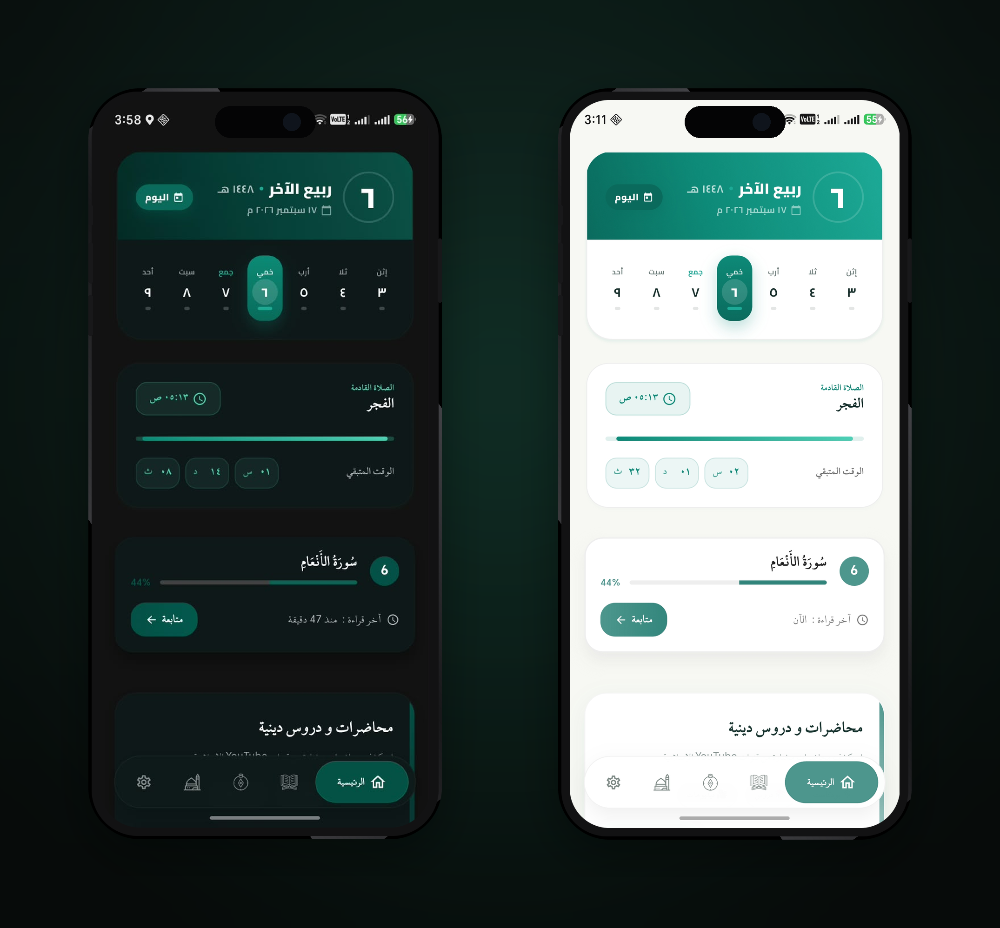
  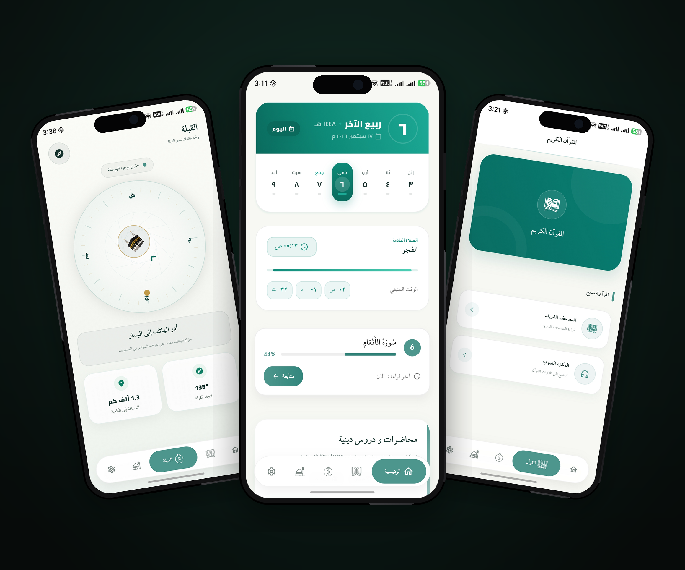
</p>

### What these screens demonstrate

- **Daily Islamic context** — the home screen presents the current Islamic date and daily information.
- **Prayer awareness** — the dashboard can surface the current/upcoming prayer and its progress.
- **Quran continuity** — reading progress can be surfaced so users can return to where they stopped.
- **Educational content** — lectures and selected Islamic content can be accessed directly from the home experience.
- **Theme support** — the interface is designed for both light and dark modes.

---

# 📖 Quran Experience

The Quran section is built around two complementary experiences: **reading** and **audio**.

<p align="center">
  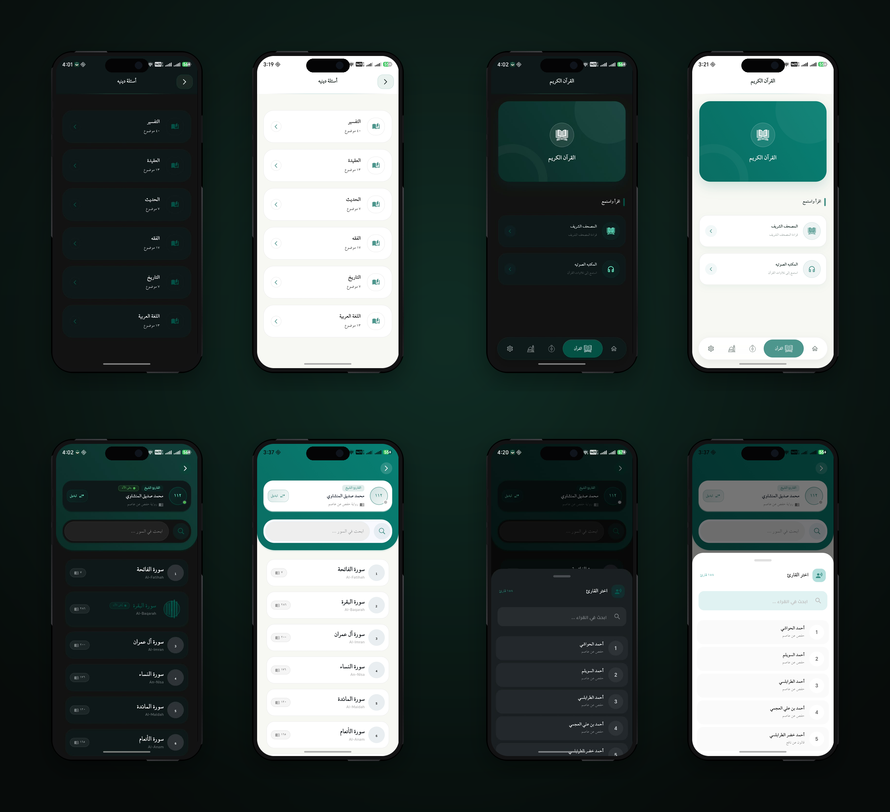
</p>

### Quran browsing

Users can browse the Quran by Surah and access individual chapters through a structured, readable interface.

### Reading experience

The reading screens focus on Arabic text presentation and provide controls for moving through the content, continuing from the previous position, and interacting with verses.

### Reciter selection

The audio side of the Quran experience provides a reciter-selection flow before playback.

---

# 🎧 Quran Audio Player

The audio experience provides a dedicated player for Quran recitation.

<p align="center">
  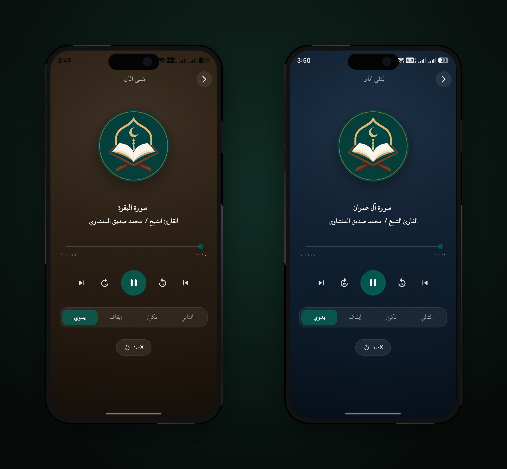
</p>

The player showcases:

- Current Surah and reciter information
- Playback progress
- Play / pause
- Previous / next controls
- Skip controls
- Playback mode options
- Repeat / continuation controls
- A focused listening experience

The screenshots also demonstrate how the player adapts its visual presentation to different themes.

---

# 🕌 Prayer Times & Islamic Youtube Channel & Jami Dua

Prayer information is integrated into the daily experience rather than treated as an isolated utility.

<p align="center">
  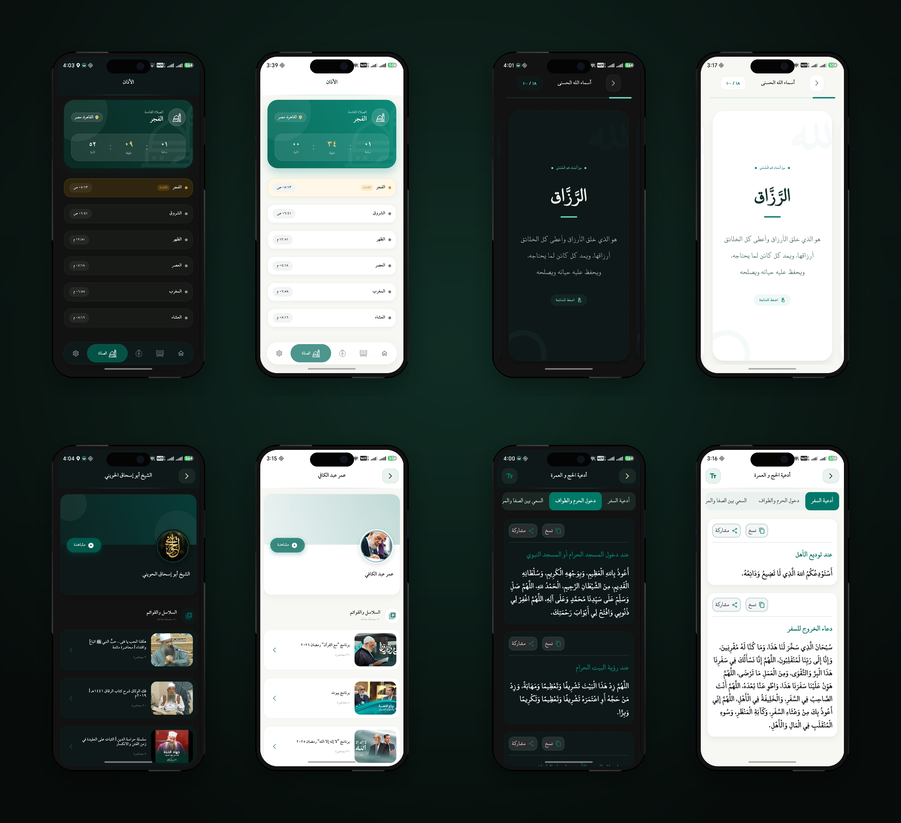
</p>

The prayer experience presents:

- Fajr
- Sunrise
- Dhuhr
- Asr
- Maghrib
- Isha
- Current/upcoming prayer
- Remaining time
- Prayer progress
- Location-aware prayer information

The same visual set also demonstrates related Islamic content screens such as Names of Allah, scholar/channel content, and organized Islamic text.

---

# 📿 Adhkar & Books of Hadith

Hisn Al-Muslim includes dedicated experiences for everyday remembrance.

<p align="center">
  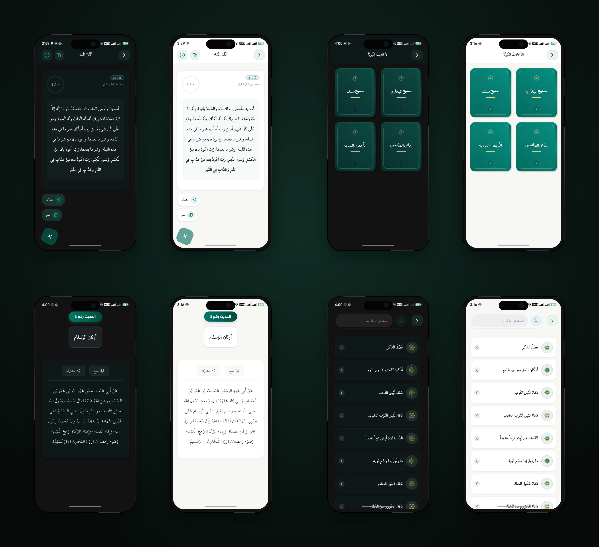
</p>

### Adhkar browsing

Users can search and browse organized remembrance content.

### Adhkar reading

Individual remembrance items are displayed in focused reading cards with actions such as sharing and copying.

### Collections

The interface also provides categorized collections so users can quickly reach the type of remembrance they need.

---

# 📜 Hadith

The application includes a dedicated Hadith experience for browsing and reading Islamic narrations.

<p align="center">
  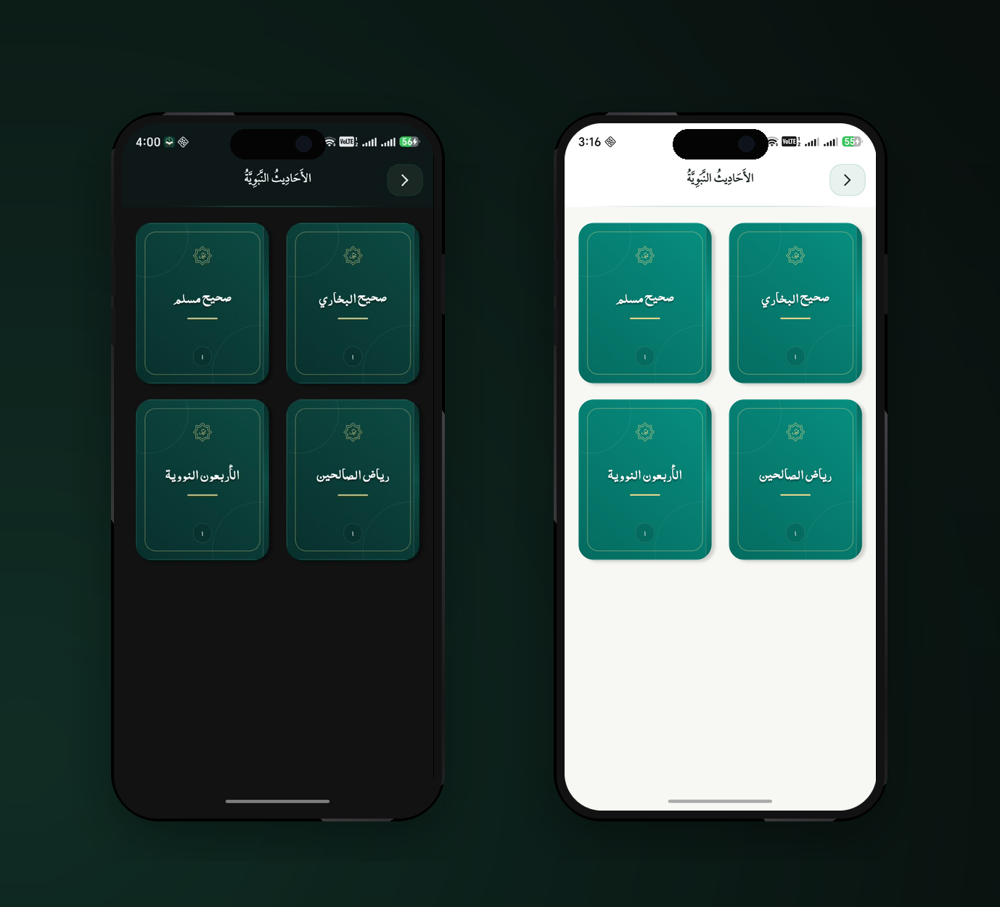
</p>


The showcase screens demonstrate:

- Hadith browsing
- Individual Hadith reading
- Search / discovery
- Sharing and copying actions
- Light and dark reading states

The source project currently includes collections such as **Sahih Al-Bukhari, Sahih Muslim, Riyad As-Salihin, and Forty Hadith Al-Nawawi**.

---

# 📚 Islamic Lectures & Educational Content

Hisn Al-Muslim also provides a content experience for Islamic lectures, lessons, and videos.

<p align="center">
  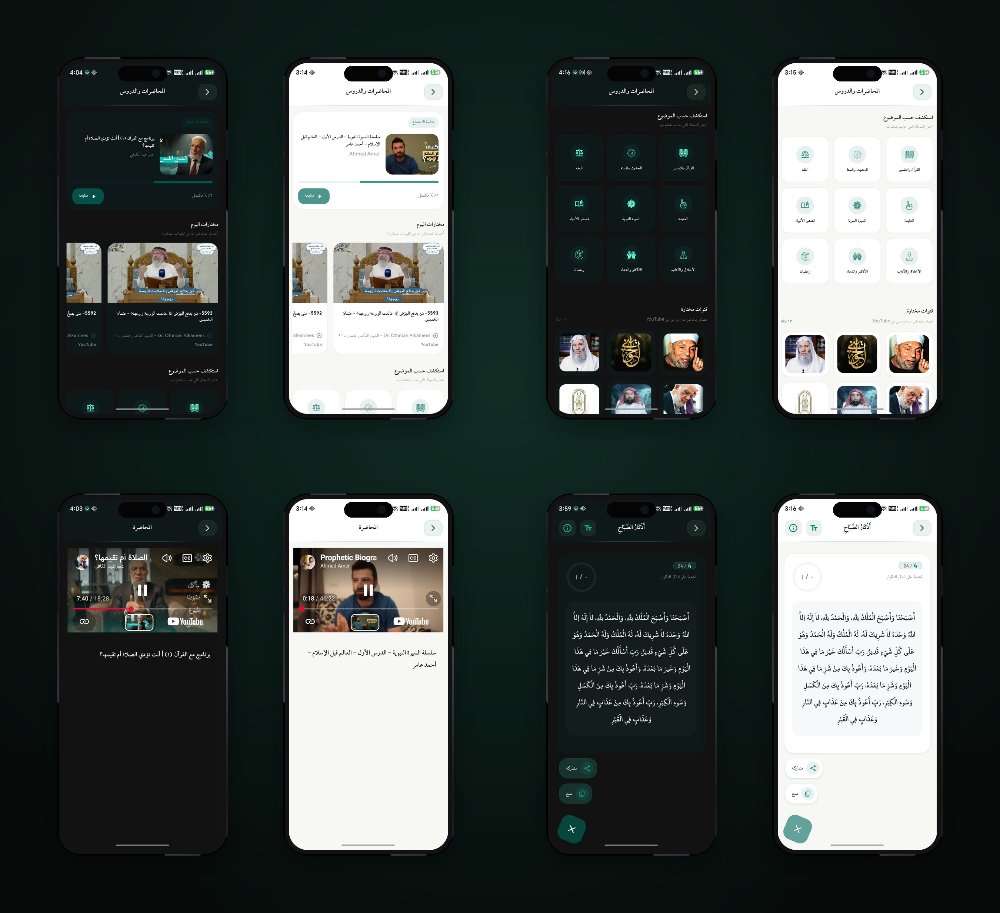
</p>

The screens demonstrate:

- Featured / selected content
- Islamic lectures
- Video cards
- Educational categories
- Islamic channels
- Playlist-oriented discovery
- YouTube-based video playback
- Content progress and continuation

The goal is to make Islamic educational material discoverable without taking the user away from the application's main experience.

---

# 🕋 Qibla Experience

The Qibla section provides a dedicated visual direction experience.

<p align="center">
  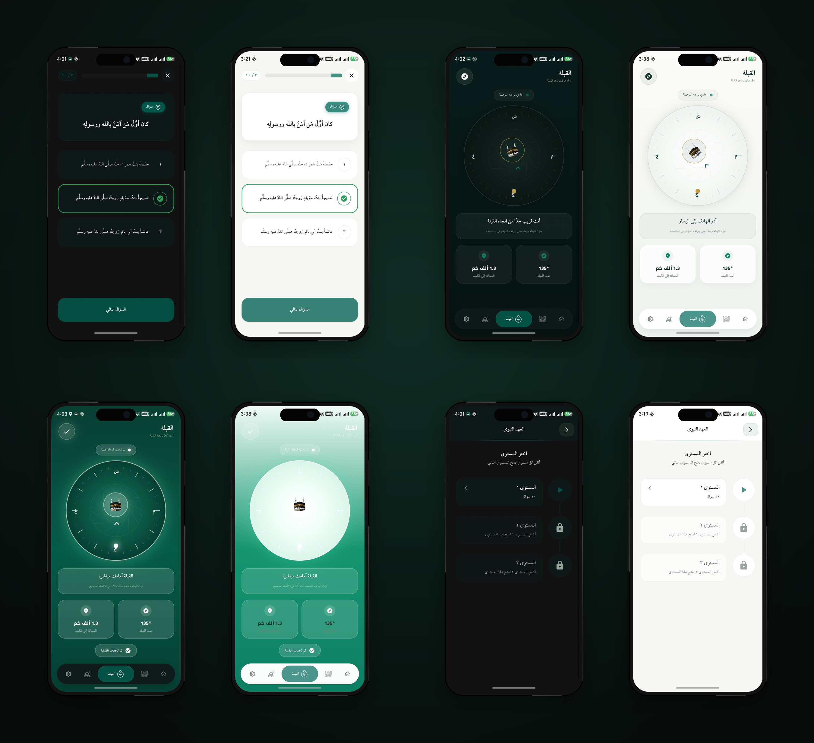
</p>

The showcased screens demonstrate:

- Qibla direction visualization
- Direction and distance information
- Location-aware presentation
- Guided interaction
- Additional Islamic progress/level states

---

# ⚙️ Settings & Personalization

The Settings experience brings appearance and reminder preferences together.

<p align="center">
  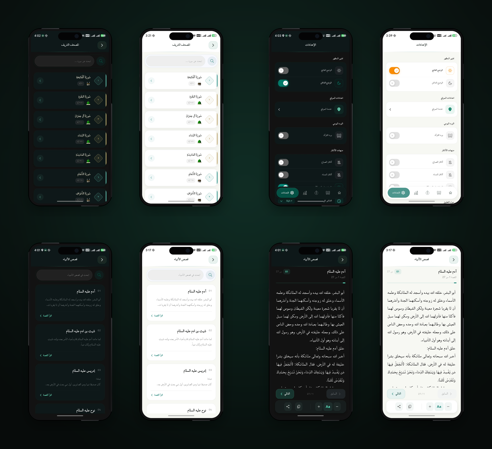
</p>

The interface demonstrates controls for areas such as:

- Light / dark appearance
- Prayer-related preferences
- Reminder settings
- Quran Wird preferences
- Adhkar reminders
- Notification preferences

The same showcase set also includes the **Stories of the Prophets** experience, with a browsable list and focused reading screen.

---

# 🤲 Additional Islamic Experiences

The application contains several supporting experiences that complement the main Quran and prayer flows.

<p align="center">
  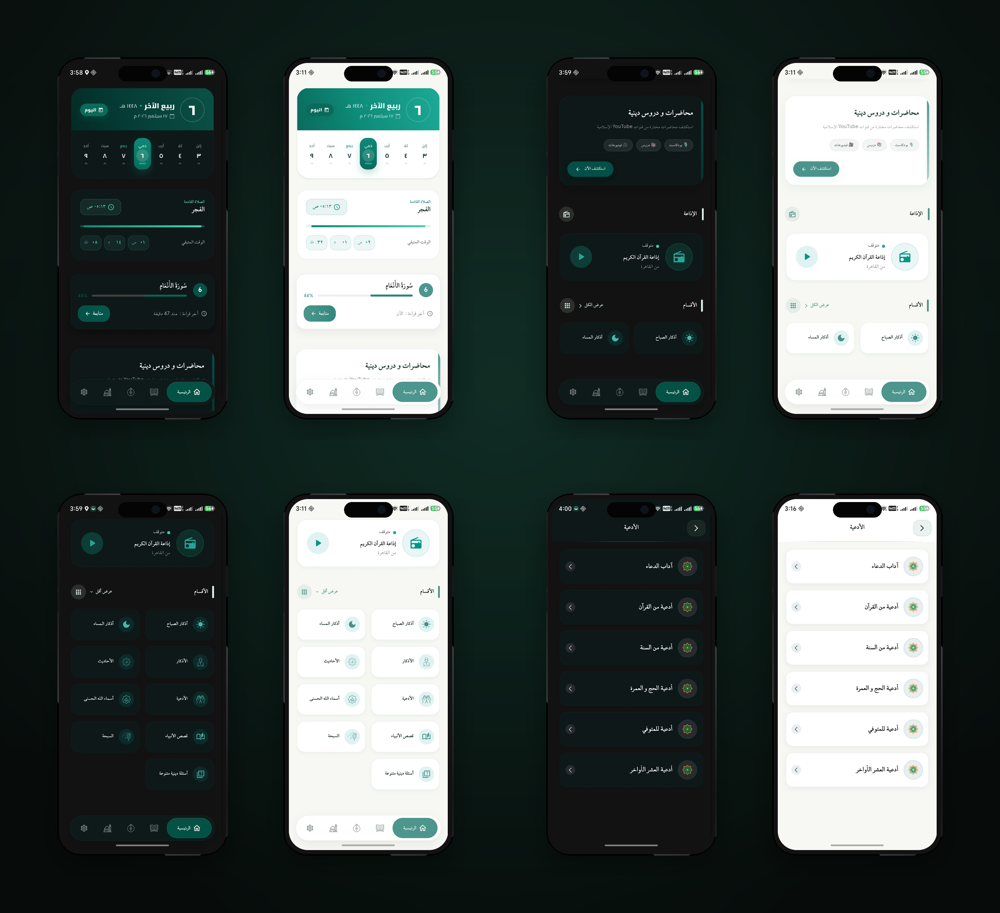
</p>

These include organized access to:

- Islamic categories
- Daily content
- Duas
- Adhkar
- Islamic learning
- Quran-related resources
- Scholar and educational content

---

# 🎨 Design System

The application follows a calm, modern visual language built around:

- Deep green / teal tones
- Clean Arabic typography
- Rounded cards and surfaces
- Clear information hierarchy
- Spacious reading layouts
- Light and dark themes
- Consistent navigation patterns
- Mobile-first interaction

The showcase intentionally presents both light and dark states to demonstrate the visual system across themes.

---

# 🛠️ Technology

The production application is built with:

| Area | Technology |
|---|---|
| Mobile framework | Flutter |
| Language | Dart |
| State management | BLoC / Cubit |
| Backend services | Firebase + HTTP/API integrations |
| Audio | Flutter audio ecosystem |
| Notifications | Local notifications |
| Location | Geolocation services |
| Educational video | YouTube integration |
| UI | Responsive Flutter UI + reusable components |

> Implementation details, internal architecture, environment configuration, service credentials, and production source code are intentionally kept outside this public repository.

---

# 🏗️ Engineering Approach

The production application is developed with an emphasis on:

- Feature-oriented organization
- Reusable UI components
- Separation of responsibilities
- State-driven UI
- Dependency injection
- Local persistence
- API-based content
- Audio service integration
- Notification scheduling
- Location-aware functionality
- Platform-specific Android/iOS configuration

This repository intentionally documents the **product and experience**, not the internal implementation.

---

# 📦 Repository Scope

This repository is intentionally limited to public showcase material:

```text
hisn-almuslim-showcase/
│
├── README.md
├── README_AR.md
├── LICENSE
├── SECURITY.md
├── CHANGELOG.md
│
├── docs/
│   └── PROJECT_OWNERSHIP.md
│
└── media/
    ├── logo/
    │   └── app-logo.png
    │
    └── screenshots/
        ├── 00-grand-showcase.png
        ├── 01-quran-audio-showcase.png
        ├── 02-home-light-dark.png
        ├── 03-home-experience.png
        ├── 04-quran-experience.png
        ├── 05-prayer-and-islamic-content.png
        ├── 06-adhkar-and-hadith.png
        ├── 07-home-and-daily-content.png
        ├── 08-lectures-and-video.png
        ├── 09-qibla-and-progress.png
        ├── 10-settings-and-stories.png
        └── 11-quran-audio-player.png
```

### What is deliberately NOT included

- ❌ Flutter source code
- ❌ `lib/`
- ❌ `android/`
- ❌ `ios/`
- ❌ Firebase configuration
- ❌ Environment files
- ❌ API keys
- ❌ Service-account credentials
- ❌ Production backend code
- ❌ Private assets or development files

---

# 🔐 Source Code & Usage

The production source code of **Hisn Al-Muslim** is maintained separately and is not distributed through this repository.

This public repository exists for:

- Product presentation
- Documentation
- UI/UX showcase
- Screenshots
- Project information
- Public release links

**The source code, application implementation, and project assets are not licensed for reuse, redistribution, copying, or commercial use through this repository.**

See [`LICENSE`](LICENSE) for the applicable terms.

---

# 👤 Project Ownership

**Hisn Al-Muslim** is an independently developed application maintained by **Omar Mohammed**.

Copyright © 2026 Omar Mohammed. All rights reserved.

This repository is the official public showcase repository for the project.

For the strongest public attribution, official distribution links and developer profiles should use the same project/developer identity when the application is released.

See [`docs/PROJECT_OWNERSHIP.md`](docs/PROJECT_OWNERSHIP.md) for the ownership and attribution statement.

---

# 📲 Distribution

Official download links will be added here as each distribution channel becomes available.

### Android

- **Google Play:** Coming soon
- **Uptodown:** Coming soon

> Only official project distribution links should be used when publishing or sharing the application.

---

# 🗺️ Project Status

**Status:** Active Development

The application continues to evolve through UI improvements, feature refinement, content updates, and platform preparation.

---

# 📄 License

This showcase repository is **not an open-source software distribution**.

Unless explicitly stated otherwise, all source code, branding, screenshots, visual assets, and project materials are protected and may not be reused or redistributed without permission.

See [`LICENSE`](LICENSE).

---

<p align="center">
  
</p>

<p align="center">
  <strong>Hisn Al-Muslim</strong><br>
  Quran • Prayer • Adhkar • Islamic Learning • Audio • Reminders
</p>
